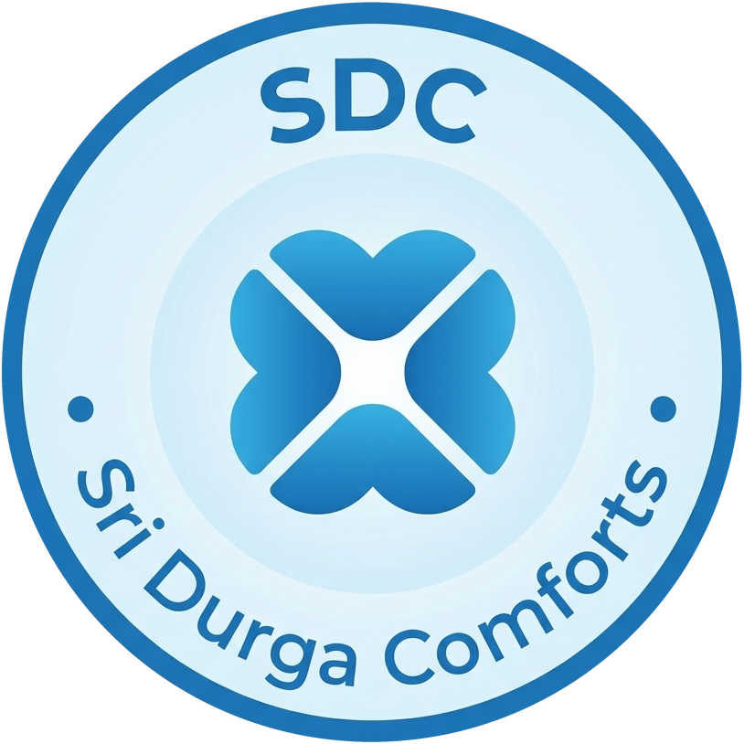

# Sri Durga Comforts 🏨

> Luxury Hospitality & Modern Boutique Stay Website for **Sri Durga Comforts**, located at Bellur Cross directly on the Mangalore–Bangalore Highway (NH-75), Karnataka.



## Overview

Sri Durga Comforts is an authentic, elegant, and modern hospitality website engineered to showcase premium lodging accommodations near **Adichunchanagiri University (ACU)**, **Adichunchanagiri Institute of Medical Sciences (AIMS)**, and the sacred **Sri Kshetra Adichunchanagiri Math**.

### Key Highlights
- **Location**: BHM Arcade, Bellur Cross, NH-75, Nagamangala Taluk, Mandya District, Karnataka 571418 (`12.9613889, 76.732863`).
- **Brand Palette**: Deep Midnight Navy (`#0B1F3A`), Heritage Royal Blue (`#163D6B`), Refined Champagne Gold (`#C9A45C`), Warm Ivory (`#F7F5F0`), and Soft Blue-Grey (`#EEF3F7`).
- **Typography**: Display Serif (`Playfair Display` & `DM Serif Display`) paired with crisp Modern Sans (`Plus Jakarta Sans`).
- **Room Options**: Clean, spacious AC & Non-AC rooms featuring elevator access, private attached bathrooms with 24/7 hot water geysers, flat-screen LED TVs, dedicated wardrobe & dressing space, and daily housekeeping.
- **Verified Amenities**: 24/7 front desk with on-duty staff, power backup, high-speed WiFi, elevator serving all floors, complimentary secure parking, CCTV security, and immediate highway access with zero detour.
- **Digital Partner**: **21techglory**

---

## Architecture & Features

- **No Framework Overhead**: Ultra-fast Vanilla HTML5, CSS3, and modern JavaScript for lightning-quick load times and near-instant Core Web Vitals.
- **Structured Schema Markup**: Full `LodgingBusiness` and `FAQPage` JSON-LD schemas for high-ranking Google Local, Map Pack, and Generative Engine Optimization (GEO).
- **Interactive Property Gallery**: High-performance responsive grid with keyboard-navigable and touch-friendly full-screen Lightbox.
- **Direct Conversion Pipeline**: Seamless WhatsApp direct inquiry compiler with pre-formatted guest reservation text, plus direct call buttons.
- **Mobile-First Experience**: Fixed bottom mobile action bar (Call, WhatsApp, Directions) with thumb-friendly controls.

---

## Project Structure

```text
├── index.html                 # Main website entry point
├── Sri Durga Comforts.html    # Full property portal
├── logo.png                   # Official SDC badge logo
├── favicon.png                # High-res favicon
├── favicon.ico                # Browser tab icon
├── apple-touch-icon.png       # iOS home-screen icon
├── assets/
│   ├── css/
│   │   └── styles.css         # Complete hospitality design system
│   ├── js/
│   │   └── main.js            # Interactive lightbox, navbar scroll & booking logic
│   ├── images/                # Standardized responsive webp/jpg photography
│   └── photos/                # Converted high-res property assets
├── .gitignore                 # Excludes environments and large media files
└── README.md                  # Project documentation
```

---

## Contact & Reservations

- **Primary Reservations**: [+91 99757 28106](tel:+919975728106)
- **Secondary Line**: [+91 73491 64171](tel:+917349164171)
- **Host**: Raghavendra (15 years in hospitality management)
- **Location Pin**: [Google Maps Directions](https://maps.app.goo.gl/2ZUZXkTBWyFUqPs5A)

---

## Credits

- **Client**: Sri Durga Comforts
- **Digital Partner**: [21techglory](https://21techglory.com)
